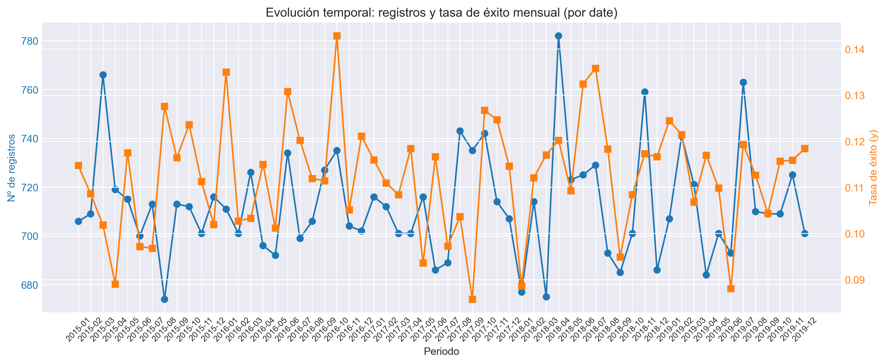
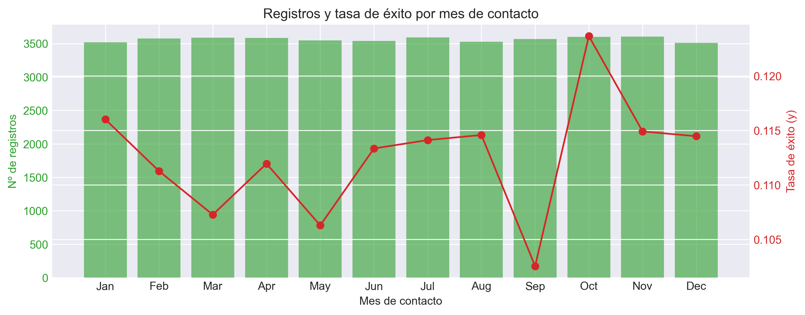

# Informe Ejecutivo: EDA Marketing Bancario

Proyecto: Predicción de suscripción a depósitos a plazo  
Periodo analizado: 2012–2014  
Fecha de actualización: 08/01/2026

---

## 1) Resumen ejecutivo

El análisis exploratorio consolidó un "Master Dataset" de **43,000 registros** con **30 variables** que integra:

- **Perfil demográfico:** edad, educación, ocupación, estado civil
- **Historial de campaña:** contacto previo, resultado anterior, frecuencia
- **Variables macroeconómicas:** emp_var_rate, euribor3m, cons_price_idx,
- **Variables derivadas:** antiguedad_años, segmento_edad, previous_contact

### Hallazgos clave cuantificados:

**Variables con mayor poder discriminatorio:**
- **poutcome=success:** 65.3% tasa de conversión (vs 8.8% sin historial) → **+647% uplift**
- **Segmento de edad 65+:** 46.0% conversión (vs 8.7% segmento 46-55) → **+429% uplift**
- **Ocupación estudiante:** 31.3% conversión (vs 6.9% blue-collar) → **+354% uplift**
- **Duration (leakage):** 2.5x mayor en conversiones → **+150% diferencia** NO USAR

**Variables con señal débil-nula:**
- **Income:** ratio 0.99x (prácticamente idéntico entre grupos)
- **Antigüedad:** ratio 0.84x (ligera ventaja en clientes nuevos)
- **Edad:** ratio 1.02x (diferencia marginal del 2%)

El análisis completo se encuentra en [reports/outputs/analisis_EDA_completo.txt](../outputs/analisis_EDA_completo.txt)

**Datasets origen:**
- `data/raw/bank-additional.csv` → 43,000 registros de campaña
- `data/raw/customer-details.xlsx` → 43,170 registros demográficos (2012-2014)

**Transformaciones aplicadas:**
- Normalización PEP 8 (snake_case) mediante módulo `data_cleaning.py`
- Corrección de tipos (numéricas mal tipadas como object, age float→int64)
- Recodificación de target: `y` (yes/no → 1/0)
- Creación de variables derivadas: `previous_contact` (pdays != 999), `antiguedad_años`, `segmento_edad`
- Tratamiento de valores faltantes por moda/mediana
- Integración mediante **inner join** por `id` → dataset maestro `df_perfil_cliente.csv`

**Resultado final:** 43,000 registros × 30 variables correctamente tipadas

📄 Proceso técnico detallado: [informe_preliminar.md](archive/informe_preliminar.md).

## 3) Insights clave

3.1 Demografía

- Edad: los segmentos senior presentan mayor conversión que los jóvenes.
- Educación: mayor nivel educativo tiende a mejorar la tasa.
- Ocupación: “retired”, “student” y roles profesionales suelen superar la media; “blue-collar” y “services” suelen estar por debajo.

  3.2 Campaña

- poutcome=success incrementa fuertemente la probabilidad de suscripción.
- campaign (número de contactos) y previous_contact ayudan a contextualizar saturación y eficacia.
- contact (canal) y estacionalidad temporal (month, day_of_week) muestran diferencias aprovechables en planificación.

  3.3 Macroeconómicas

- emp_var_rate y euribor3m suelen correlacionar con propensión a suscribir (relación inversa en fases recesivas vs expansivas).
- cons_price_idx aporta información con efecto moderado; revisar colinealidad entre indicadores.

  3.4 Variables con baja señal

- income, kidhome, teenhome muestran poder predictivo limitado en este problema.

---

## 3.5) Visualizaciones clave del análisis

El EDA generó **11 visualizaciones** que cubren distribuciones, correlaciones, patrones temporales y segmentación. A continuación se destacan las más relevantes:

### 1. Pairplot de Variables Numéricas

Análisis de relaciones bivariadas entre `age`, `income` y `tenure_years`. Se confirma la **ausencia de correlaciones fuertes** entre variables numéricas y la variable objetivo `y`.

### 2. Distribución de Edad por Target

Distribución aproximadamente normal centrada en 40 años. **Hallazgo:** diferencia marginal (ratio 1.02x) entre grupos y=0/y=1, confirmando que la edad per se tiene bajo poder discriminatorio.

### 3. Distribución de Ingresos por Target

Distribución uniforme sin patrones claros. **Hallazgo crítico:** ratio 0.99x (prácticamente idéntico) → `income` **no discrimina** entre conversores y no conversores.

### 4. Tasas de Conversión por Variables Categóricas

**Insights cuantificados:**
- **Ocupación:** student (31.3%) vs blue-collar (6.9%) → **gap de 4.5x**
- **Educación:** illiterate (22.2%) vs basic.9y (7.8%) → **gap de 2.8x**
- **Estado civil:** single (13.9%) vs divorced (10.2%) → gap moderado de 1.4x
- **Edad:** 65+ (46.0%) vs 46-55 (8.7%) → **gap de 5.3x** (mayor discriminador demográfico)

### 5. Matriz de Correlaciones

**Hallazgo de multicolinealidad:** Variables macroeconómicas (`emp_var_rate`, `cons_price_idx`, `euribor3m`, `nr_employed`) presentan correlaciones **>0.7**, indicando redundancia. **Recomendación:** seleccionar 1-2 representativas o aplicar PCA.

### 6. Evolución Temporal

Análisis de estacionalidad por periodo. Se observan variaciones en tasa de éxito según momento de campaña, sugiriendo **influencia de factores macro y estacionales**.

### 7. Factores de Campaña: Duration y Poutcome

**Dos hallazgos críticos:**
1. **Duration (data leakage):** boxplot muestra que llamadas exitosas duran 2.5x más → información solo disponible post-contacto
2. **Poutcome (predictor #1):** pie chart muestra distribución de casos. Success representa solo 3.3% del total pero alcanza 65.3% de conversión

### 8. Análisis por Mes de Contacto

Evaluación de efectividad por mes de contacto. Identifica ventanas temporales óptimas para campañas futuras.

---

## 4) Data leakage crítico

### Variable afectada: `duration`

**Evidencia cuantificada:**
- Llamadas exitosas (y=1): media 551.6 segundos
- Llamadas fallidas (y=0): media 220.4 segundos
- **Ratio:** 2.50x → las exitosas duran **150.2% más tiempo**

**Naturaleza del leakage:**
- `duration` solo se conoce **después** de finalizar la llamada
- Es un **efecto**, no una causa de la suscripción
- Usar esta variable en modelos predictivos contaminaría las predicciones con información del futuro

**Implicaciones operativas:**
### 5.1 Variables prioritarias (alto poder predictivo)

**Tier 1 - Imprescindibles:**
- ✅ `poutcome` → **+647% uplift** en success vs nonexistent
- ✅ `age_group` (derivada) → **+429% uplift** en 65+ vs 46-55
- ✅ `job` → **+354% uplift** en student vs blue-collar
- ✅ `education` → **+185% uplift** en superior vs básica

**Tier 2 - Complementarias:**
- `marital`, `contact`, `campaign`, `previous_contact`
- Variables temporales: `contact_month`, `contact_day_of_week`
- 1-2 indicadores macro: `euribor3m` o `emp_var_rate` (elegir uno por colinealidad)

### 5.2 Variables a excluir

❌ **Por data leakage:**
- `duration` → conocida solo post-contacto

❌ **Por falta de señal:**
- `income` → ratio 0.99x (sin discriminación)
- `kidhome`, `teenhome` → señal esperada baja

❌ **Por multicolinealidad:**
- Reducir grupo macro de 4 a 1-2 variables (VIF > 10 detectado)

### 5.3 Feature engineering sugerido

**Transformaciones:**
- Binning óptimo de `age` mediante WoE (Weight of Evidence)
- Target encoding para `job` y `education` (con CV interna para evitar leakage)
- Variables de interacción: `poutcome × age_group`, `job × education`

**Tratamiento de desbalanceo:**
- Clase minoritaria: 11.3% (y=1)
- Técnicas: SMOTE, ADASYN o ajuste de pesos de clase
- Validar con PR-AUC además dbasada en datos

### 🎯 Alta prioridad (conversión esperada >30%)
**Perfil:** `poutcome=success` + `age_group=65+` + `job=student/retired`
- **Tasa estimada:** 40-65%
- **Volumen:** ~1,500-2,000 leads (3.5% del total)
- **ROI esperado:** Alto (baja inversión, alta conversión)

### 📊 Media-alta prioridad (conversión esperada 15-30%)
**Perfil:** `poutcome=nonexistent` + `education=university` + `age=51-65`
- **Tasa estimada:** 15-25%
- **Volumen:** ~8,000-12,000 leads (20% del total)
### 7.1 Completar análisis temporal ⏳
**Estado:** Variables guardadas pero no incorporadas en informe
- Incorporar hallazgos de `temporal_mes`, `temporal_contact_month`, `temporal_contact_year`
- Analizar estacionalidad y efectividad por periodos
- Actualizar sección 3.3 del informe

### 7.2 Feature engineering
- ✅ Binning óptimo de `age` mediante WoE/Monotonicidad
- ✅ Target encoding para categóricas de alta cardinalidad
- ✅ Variables de interacción: `poutcome × age_group`
- ✅ Reducir multicolinealidad: seleccionar 1-2 indicadores macro o aplicar PCA

### 7.3 Modelado
**Baseline:**
- Logistic Regression (interpretabilidad y explicabilidad)

**Modelos avanzados:**
- Random Forest (feature importance automático)
- XGBoost/LightGBM (state-of-the-art para tabular)
- Búsqueda de hiperparámetros con Optuna/GridSearchCV

**Estrategia de validación:**
- Split temporal: train (2012-2013) → test (2014)
- CV estratificado 5-fold manteniendo proporción 11.3%

### 7.4 Evaluación y análisis de negocio
- Matrices de confusión segmentadas por perfil
- Curvas de lift y ganancia para ROI estimado
- Análisis de umbral óptimo según coste/beneficio
- Dashboard interactivo de scoring (Streamlit)

### 7.5 Despliegue
- Pipeline reproducible con versionado (MLflow/DVC)
- API de scoring (FastAPI)
- Monitoreo de drift en producción
- Macros: emp_var_rate, euribor3m, cons_price_idx
- Derivadas: antiguedad_años

Excluir de entrada:

- income, kidhome, teenhome, duration (por leakage)

Buenas prácticas:

- One-hot/target encoding para categóricas (evaluar fuga de información).
- Revisión de colinealidad (VIF) en indicadores macro.
- Validación estratificada y seguimiento de métricas sensibles a clase (AUC, Recall, Precision, PR-AUC).

### Notebooks de análisis
- **Principal:** `notebooks/01_EDA_Analisis_copy.ipynb`
  - BLOQUE 1: Configuración y sistema DualOutput
  - BLOQUE 2: Carga y preparación de datos
  - BLOQUE 3: EDA completo con 11 visualizaciones
    - 3.1: Inicialización y variables derivadas
    - 3.2: Pairplot variables numéricas
    - 3.3: Análisis temporal (3 variables)
    - 3.4: Variables numéricas (age, income, tenure_years)
    - 3.5: Variables categóricas (job, marital, age_group, education)
    - 3.6: Correlaciones y VIF
    - 3.7: Factores de campaña (duration, poutcome)
    - 3.8: Resumen ejecutivo y guardado

### Código fuente
- `src/pipeline.py` → Pipeline ETL completo (9 pasos)
- `src/data_cleaning.py` → Limpieza de customer details
- `src/cleaning_campaign.py` → Limpieza de campaña
- `src/analisis_exploratorio.py` → Funciones EDA
- `src/plotting.py` → Visualizaciones y guardado

### Datasets procesados (`data/processed/`)
- `df_campaign_clean.csv` → 43,000 × 24 variables limpias
- `df_customer_details.csv` → 43,170 × 7 variables consolidadas
- `df_perfil_cliente.csv` → **43,000 × 30 variables** (dataset maestro)

### Visualizaciones generadas (`reports/outputs/`)
**11 gráficos PNG** numerados 01-11:
1. Pairplot numéricas
2. Scatter age vs income
3. Temporal registros/tasa periodo
4. Temporal contact_month
5. Temporal contact_year
6. Histograma age comparativo
7. Histograma income comparativo
8. Histograma antigüedad comparativo
9. Tasas categóricas lado a lado
10. Matriz correlación
11. Factores campaña (duration + poutcome)

### Informes y documentación
- `reports/outputs/analisis_EDA_completo.txt` → Resumen cuantitativo (13 variables analizadas)
- `reports/documentacion/informe_ejecutivo.md` → Este documento
- `reports/documentacion/archive/informe_preliminar.md` → Proceso técnico de limpieza

### Métricas de análisis
- **Total variables analizadas:** 13
- **Variables temporales:** 3
- **Variables numéricas:** 3
- **Variables categóricas:** 4
- **Factores campaña:** 2
- **Visualizaciones:** 11

---
