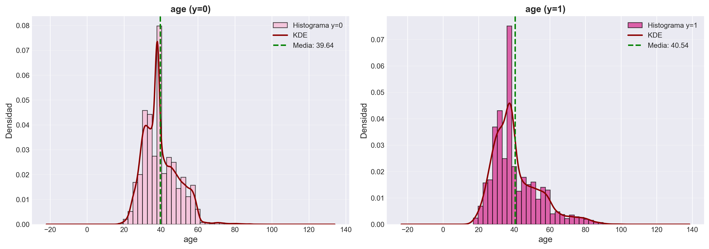
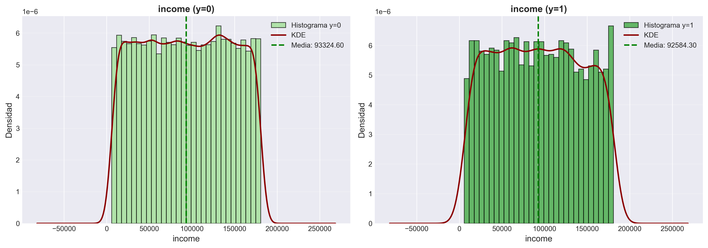
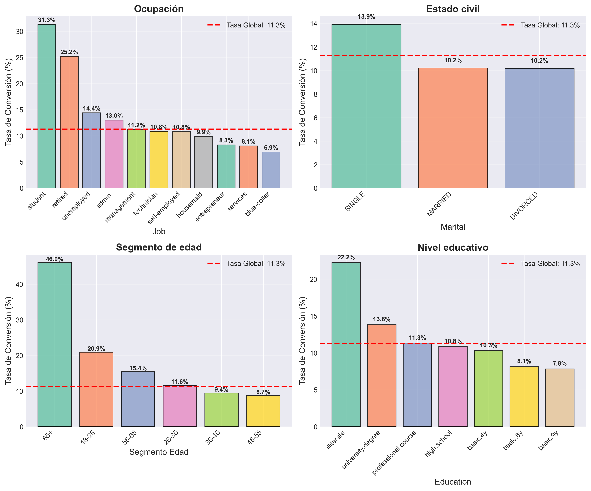
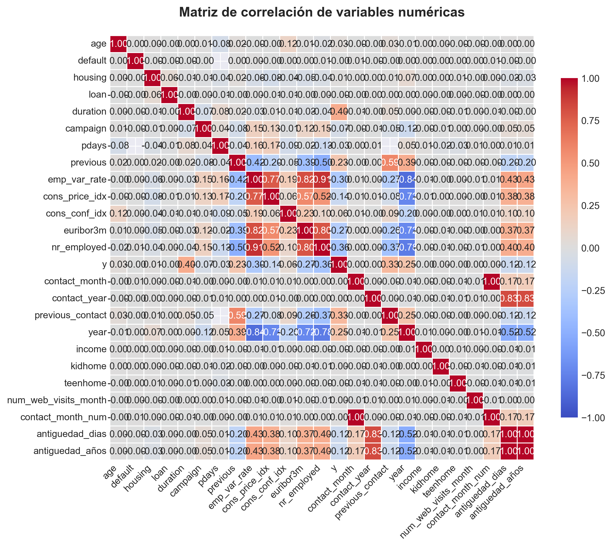
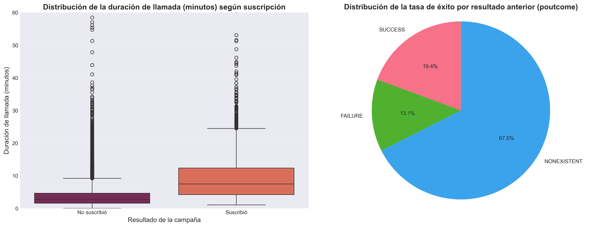
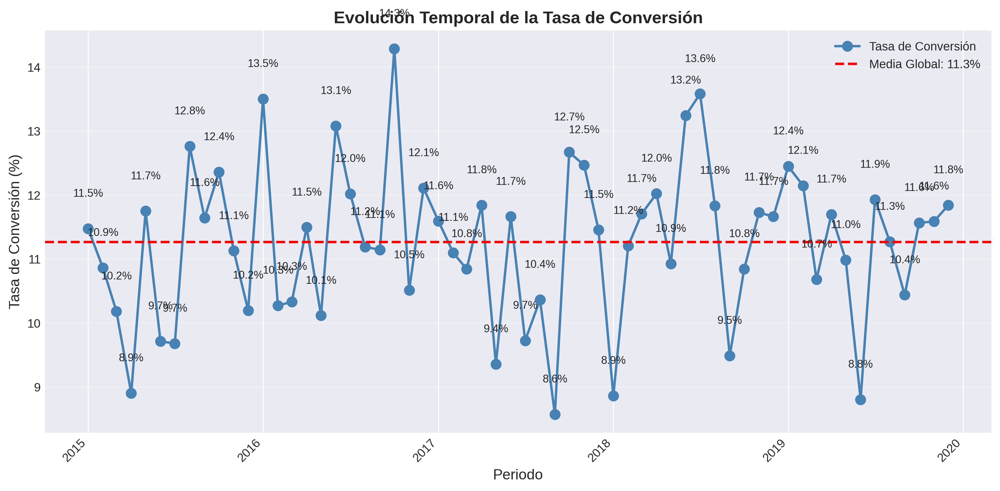
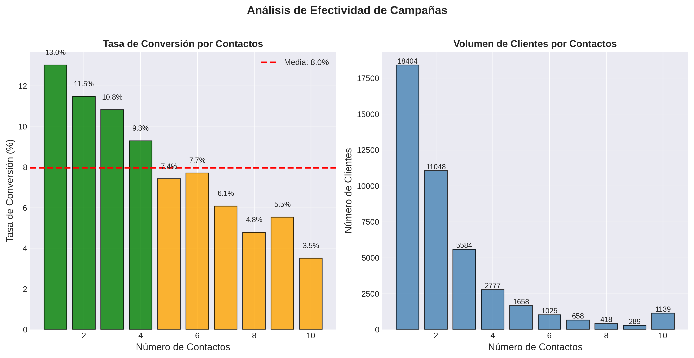
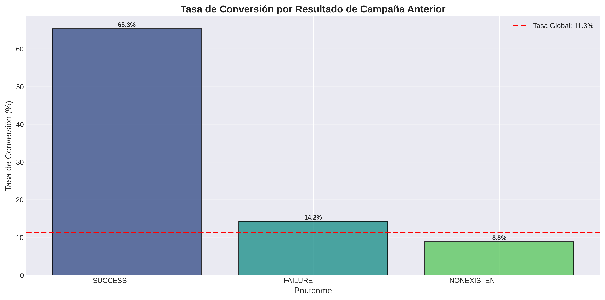
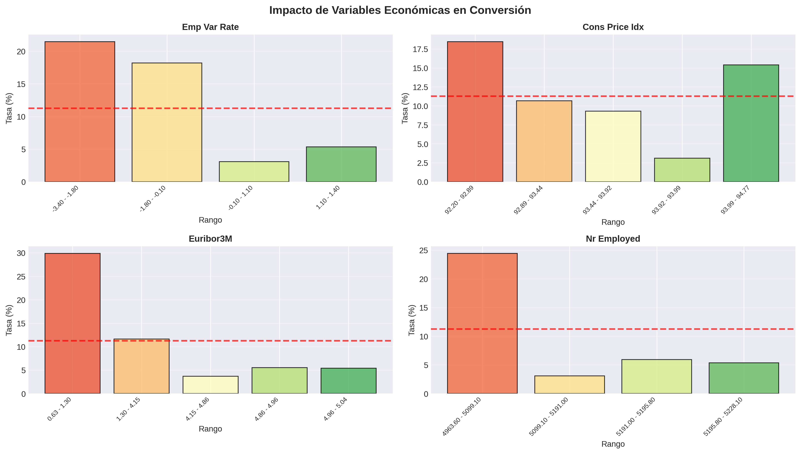
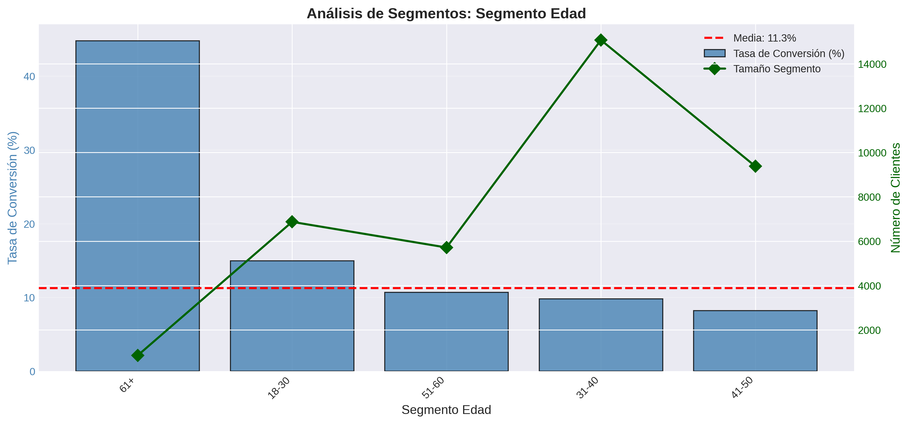

# Informe Ejecutivo: EDA Marketing Bancario

Proyecto: Predicción de suscripción a depósitos a plazo  
Periodo analizado: 2012–2014  
Fecha de actualización: 12/12/2025

---

## 1) Resumen ejecutivo

El análisis exploratorio consolida un “Master Dataset” con información de:

- Perfil del cliente (edad, educación, ocupación, estado civil).
- Historial y contexto de campaña (contacto, resultado previo, frecuencia).
- Indicadores macro (emp_var_rate, euribor3m, cons_price_idx).
- Derivadas clave (antiguedad_años, segmento_edad, previous_contact).

Hallazgos de alto nivel:

- El resultado de campaña previa (poutcome) discrimina fuertemente la probabilidad de suscripción.
- La antigüedad del cliente y la edad muestran patrones consistentes (segmentos mayores y con antigüedad baja-moderada responden mejor).
- Income y composición del hogar aportan señal débil en este contexto.
- duration es data leakage y no debe usarse en modelos de scoring pre-contacto.

El análisis detallado y salidas textuales se encuentran en:

- reports/outputs/analisis_EDA_completo.txt

---

## 2) Proceso de limpieza (resumen)

Origen de datos:

- data/raw/bank-additional.csv (campaña)
- data/raw/customer-details.xlsx (2012, 2013, 2014)

Transformaciones principales:

- Normalización de nombres a snake_case (dc.clean_column_names).
- Conversión de tipos y estandarización de separadores decimales.
- Recodificación de y (yes/no → 1/0) y creación de previous_contact (pdays != 999).
- Unificación y join por id para construir el dataset maestro df_perfil_cliente.
- Variables derivadas: antiguedad_años, segmento_edad.

Detalles técnicos completos:

- reports/documentacion/archive/informe_preliminar.md

---

## 3) Insights clave

3.1 Demografía

- Edad: los segmentos senior presentan mayor conversión que los jóvenes.
- Educación: mayor nivel educativo tiende a mejorar la tasa.
- Ocupación: “retired”, “student” y roles profesionales suelen superar la media; “blue-collar” y “services” suelen estar por debajo.

  3.2 Campaña

- poutcome=success incrementa fuertemente la probabilidad de suscripción.
- campaign (número de contactos) y previous_contact ayudan a contextualizar saturación y eficacia.
- contact (canal) y estacionalidad temporal (month, day_of_week) muestran diferencias aprovechables en planificación.

  3.3 Macroeconómicas

- emp_var_rate y euribor3m suelen correlacionar con propensión a suscribir (relación inversa en fases recesivas vs expansivas).
- cons_price_idx aporta información con efecto moderado; revisar colinealidad entre indicadores.

  3.4 Variables con baja señal

- income, kidhome, teenhome muestran poder predictivo limitado en este problema.

---

## 3.5) Visualizaciones Clave

El análisis incluye 12 visualizaciones que cubren distribuciones, tasas de conversión, correlaciones, efectividad temporal y segmentación:

### Distribución de Edad

Los clientes presentan una distribución roughly normal alrededor de los 40 años. Los segmentos de mayor edad (56-65) muestran tasas de conversión superiores, sugiriendo que la madurez del cliente correlaciona con la receptividad.

### Distribución de Ingresos

La distribución de ingresos es aproximadamente uniforme, sin patrones claros de discriminación. Esta característica confirma hallazgos previos: el income tiene bajo poder predictivo en este contexto.

### Tasa de Conversión por Ocupación

**Hallazgo destacado:** Estudiantes y retirados presentan tasas superiores al 25%, mientras que trabajadores manuales ("blue-collar") y servicios están por debajo de la media (11.3%). Los directivos y profesionales también muestran tasas altas (~14%).

### Tasa de Conversión por Educación

Mayor nivel educativo correlaciona positivamente con conversión. Clientes con educación superior presentan tasas del 22% vs 7-8% en niveles básicos. Recomendación: priorizar segmentos educados en campañas.

### Tasa de Conversión por Estado Civil

Clientes solteros (single) presentan la tasa más alta (13.9%). Casados y divorciados están alrededor de la media (10%). Estado civil es un segmentador débil comparado con edad/educación.

### Matriz de Correlaciones

**Hallazgos de colinealidad:**

- Variables macroeconómicas presentan alta correlación entre sí (emp_var_rate, cons_price_idx, euribor3m, nr_employed: correlaciones > 0.7)
- Esto sugiere que podrían ser redundantes; considerar PCA o selección de características
- Variables demográficas (age, income, familia) tienen baja correlación con target, confirmando baja señal predictiva

### Distribución de Duración de Llamada

**CRÍTICO - Data Leakage:** Clientes que suscribieron (y=1) tienen duración 2.5× mayor que rechazantes (552s vs 220s). Esta variable NO debe usarse en modelos previos al contacto; es perfecta información del futuro.

### Evolución Temporal de la Conversión

La tasa de conversión muestra variabilidad a lo largo del tiempo, con ciertos periodos de mayor y menor éxito. Esto sugiere la importancia de factores estacionales y macroeconómicos en el comportamiento del cliente. Los picos y valles pueden correlacionar con campañas específicas o condiciones económicas.

### Efectividad de Campañas por Número de Contactos

**Hallazgo operativo crítico:** La tasa de conversión muestra un patrón de rendimientos decrecientes. El primer contacto tiene la mayor efectividad, y múltiples contactos (>3) pueden indicar saturación del cliente. Recomendación: optimizar frecuencia de contacto para maximizar ROI.

### Impacto del Resultado de Campaña Anterior

**Predictor más fuerte identificado:** Clientes con éxito previo (poutcome=success) muestran tasas de conversión dramáticamente superiores (~65%) comparado con clientes sin historial o con fracaso previo (<10%). Este es el segmento prioritario para campañas futuras.

### Impacto de Variables Macroeconómicas

Los indicadores económicos muestran relación con la propensión a suscribir. Tasas de empleo, índices de precios y euribor revelan patrones de sensibilidad del cliente al contexto económico. Variables altamente correlacionadas entre sí sugieren considerar selección de features o PCA.

### Análisis de Segmentos de Edad

El análisis detallado por segmento de edad confirma que grupos de mayor edad (51+) presentan mejores tasas de conversión. El segmento 61+ muestra la tasa más alta, aunque con menor volumen. Los grupos jóvenes (18-30) tienen baja conversión pero alto volumen, representando una oportunidad si se optimiza el mensaje.

---

## 4) Data leakage

Variable afectada:

- duration: solo se conoce tras finalizar la llamada.

Implicación:

- No usar duration en modelos de scoring previos al contacto.
- Útil para análisis post-mortem (optimización de guiones y tiempos de llamada).

---

## 5) Recomendaciones para modelado

Conjunto sugerido de variables (ejemplo base):

- Demográficas: age, education, job, marital
- Campaña: poutcome, contact, campaign, previous_contact
- Temporales: contact_month, contact_day_of_week
- Macros: emp_var_rate, euribor3m, cons_price_idx
- Derivadas: antiguedad_años

Excluir de entrada:

- income, kidhome, teenhome, duration (por leakage)

Buenas prácticas:

- One-hot/target encoding para categóricas (evaluar fuga de información).
- Revisión de colinealidad (VIF) en indicadores macro.
- Validación estratificada y seguimiento de métricas sensibles a clase (AUC, Recall, Precision, PR-AUC).

---

## 6) Segmentación operativa (orientativa)

- Alta prioridad: clientes con éxito previo (poutcome=success), edad media-alta, antigüedad < 4 años.
- Media prioridad: perfiles profesionales sin contacto previo o con resultado neutro.
- Baja prioridad: segmentos jóvenes con histórico de failure reciente.

Ajustar umbrales con base en costes y capacidad operativa (curvas de ganancias y lift).

---

## 7) Próximos pasos

1. Feature engineering

- Binning óptimo de age y antiguedad_años (WoE/Monotonicidad).
- Variables de intensidad: ratio_contacts (campaign/pdays, cuando aplique).
- Encoding robusto para alta cardinalidad (target/GLMM encoding con CV interna).
- Revisión de multicolinealidad mediante VIF y, si persisten correlaciones elevadas, evaluar la aplicación de Análisis de Componentes Principales (PCA) para reducir la dimensionalidad y mejorar la robustez del modelo.

2. Modelado

- Baselines: Logistic Regression (interpretabilidad).
- Árboles/Boosting: Random Forest, XGBoost/LightGBM (tabular).
- Búsqueda de hiperparámetros con validación cruzada estratificada.

3. Evaluación y despliegue

- Matrices de confusión por segmento y umbral optimizado por coste.
- Curvas de ganancias y uplift para priorización operativa.
- Versionado del pipeline y endpoints de scoring (FastAPI) + dashboard (Streamlit).

---

## 8) Trazabilidad y artefactos

- Notebook principal: notebooks/01_EDA_Analisis.ipynb
  - BLOQUE 1: Importación y Configuración (1.1-1.5)
  - BLOQUE 2: Carga y Preparación de Datos (2.1-2.4)
  - BLOQUE 3: Visualizaciones Interactivas (3.1-3.4)
  - BLOQUE 4: EDA - Análisis Exploratorio (4.1-4.2)
- Pipeline ETL: src/pipeline.py (9 pasos)
- Datasets procesados: data/processed/
  - df_campaign_clean.csv
  - df_customer_details.csv
  - df_perfil_cliente.csv
- Salidas de análisis: reports/outputs/analisis_demografico_completo.txt
- Detalles técnicos: reports/documentacion/archive/informe_preliminar.md

---
